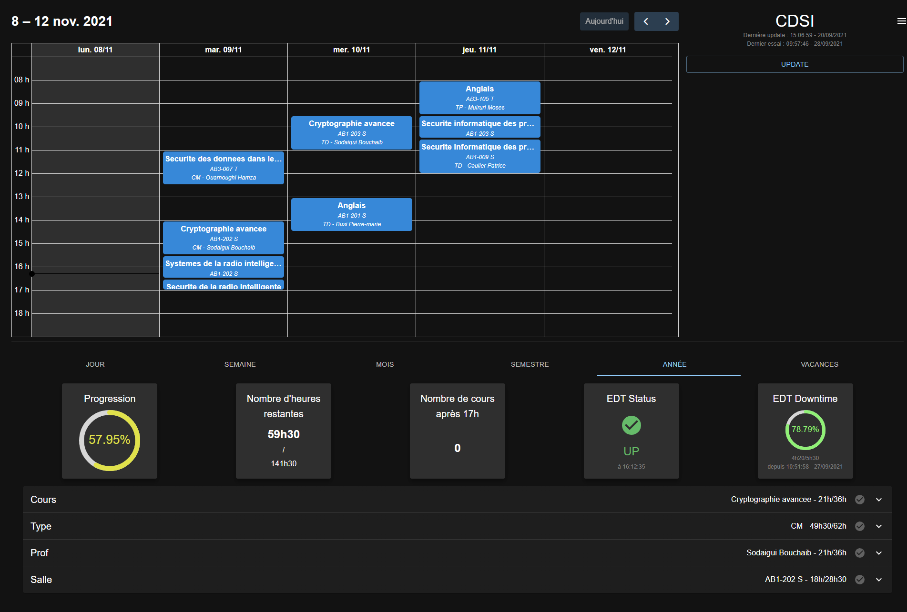

  <h3 align="center">Better INSA Schedule</h3>
  

    A better schedule for students. Made for INSA UPHF.
     
    <a href="https://edt.mathisengels.fr">Live version</a>
    ·
    <a href="https://github.com/MathisEngels/better-insa-schedule/issues">Report Bug</a>
    ·
    <a href="https://github.com/MathisEngels/better-insa-schedule/issues">Request Feature</a>
  

## About the project

Better INSA Schedule is a web app tracking your schedule, giving you more transparency about your schedule, and a better user experience overall. 
It also allows you to have more redundancy over your data in case of any crash.

Better INSA Schedule is also desktop and mobile friendly, so you can access it from everywhere.

## Usage

Just [click here](https://edt.mathisengels.fr) and enter the password you have been given.

Full link : https://edt.mathisengels.fr

## Roadmap

- [x] Calendar
- [x] Status indicator
- [x] A lot of statistics
- [ ] GitHub Actions (To build with Actions and clean code)
- [ ] A better way to implement more schedules
- [ ] Refractor code
- [ ] Logo
- [ ] Color by type / class
- [ ] Export to..
    - [ ] Google Calendar
    - [ ] VCS
    - [ ] More?
- [ ] More roles to be able to have multiples calendars
- [ ] Being able to see multiple calendars at the same time
- [ ] Automatic updates of the stats
- [ ] Documentation
- [ ] A guide to install it locally
- [ ] Move to Typescript

See the [open issues](https://github.com/MathisEngels/better-insa-schedule/issues) for a full list of proposed features (and known issues).

## Contributing

Contributions are what make the open source community such an amazing place to learn, inspire, and create. Any contributions you make are **greatly appreciated**.

If you have a suggestion that would make this better, please fork the repo and create a pull request. You can also simply open an issue with the tag "enhancement".
Don't forget to give the project a star! Thanks again!

1. Fork the Project
2. Create your Feature Branch (`git checkout -b feature/AmazingFeature`)
3. Commit your Changes (`git commit -m 'Add some AmazingFeature'`)
4. Push to the Branch (`git push origin feature/AmazingFeature`)
5. Open a Pull Request

## License

Distributed under the GNU GPLv3 License. See `LICENSE.txt` for more information.

## Contact

Mathis ENGELS - [@Tiis__](https://twitter.com/Tiis__) - mathisengels@yahoo.fr

Project Link: [https://github.com/MathisEngels/better-insa-schedule](https://github.com/MathisEngels/better-insa-schedule/)

(<a href="#top">back to top</a>)
